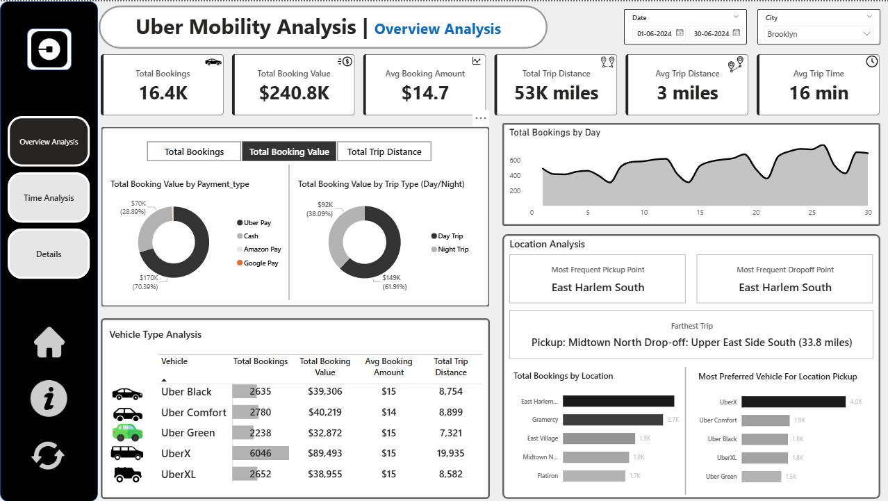
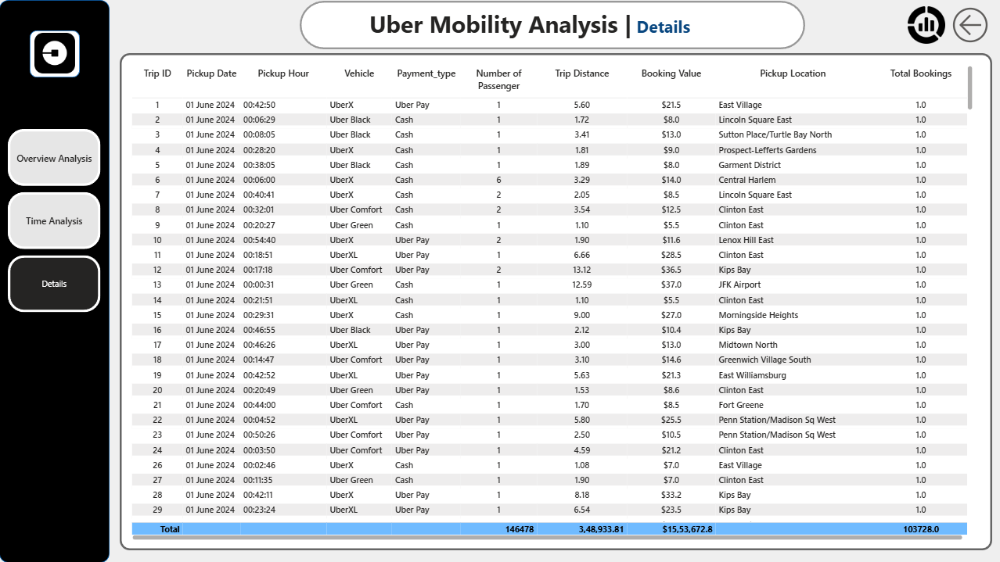

# 🚖 Uber Mobility Analysis Dashboard (Power BI)

  

---

## 🚀 Project Overview

This project presents an **end-to-end Power BI dashboard** built to analyze **Uber mobility data** across bookings, revenue, distance, time, and locations.

It converts raw trip data into **actionable business insights** that help stakeholders improve **pricing strategy, driver allocation, and operational efficiency**.

> 💡 Built with a **business-first mindset** — dashboards that drive decisions.

---

## 🎯 Business Problem

Urban mobility companies need to understand:

* When demand is highest
* Which locations generate the most trips
* What vehicle types customers prefer
* How time impacts booking behavior
* Where revenue is generated

This dashboard answers all of that in **one interactive Power BI solution**.

---

## 🔑 Key KPIs Tracked

| KPI                 | Description        |
| ------------------- | ------------------ |
| Total Bookings      | Total trips booked |
| Total Booking Value | Total revenue      |
| Avg Booking Value   | Revenue per trip   |
| Total Trip Distance | Total miles        |
| Avg Trip Distance   | Avg miles per trip |
| Avg Trip Time       | Avg duration       |
| Peak Hours          | High demand time   |
| Top Locations       | Hotspot areas      |

---

# 📊 Dashboard Pages

---

## 1️⃣ Overview Analysis

  

### 🔍 What This Shows

* Overall performance KPIs
* Revenue & booking trends
* Payment type distribution
* Vehicle performance
* Location intelligence

### 📈 Key Insights

✔ UberX is the most booked vehicle
✔ Cash & Uber Pay dominate payments
✔ East Harlem South is top pickup & drop
✔ Day trips generate ~62% revenue
✔ Longest trip identified for pricing analysis

---

## 2️⃣ Time Analysis

  

### ⏰ What This Shows

* Bookings by pickup time
* Hour × Day heatmap
* Weekday vs weekend demand
* Peak & off-peak analysis

### 📈 Key Insights

✔ Peak demand: 8–11 AM & 5–8 PM
✔ Lowest demand: 1–5 AM
✔ Weekend demand is higher
✔ Friday & Sunday are peak days

---

## 3️⃣ Trip Details (Drill-Through Page)

  

### 🧾 What This Shows

* Trip-level raw data
* Drill-through from any chart
* Filtered & full data toggle
* Export-ready table

### 🎯 Why It Matters

✔ Auditing & deep analysis
✔ Operational review
✔ Data validation
✔ Shows advanced Power BI skills

---

## 🧠 Insights That Matter (HR Favourite Section)

✔ Business KPI understanding
✔ Advanced Power BI + DAX
✔ Dynamic measures & slicers
✔ Drill-through & bookmarks
✔ Storytelling with data
✔ Interview-ready project

---

## 🛠️ Tools & Technologies Used

* Power BI Desktop
* DAX (Advanced Measures)
* Power Query (ETL)
* Star Schema Data Model
* Disconnected Tables
* Bookmarks & Drill-through
* Heatmaps & Interactive Visuals

---

## 🗂️ Data Model

**Fact Table**

* Uber Trips

**Dimension Tables**

* Date
* Location
* Vehicle
* Payment Type
* Time

Optimized using **Star Schema** for performance.

---

## 📌 How to Use

1. Download the `.pbix` file
2. Open in Power BI Desktop
3. Use slicers (Date, City, Measure)
4. Drill through visuals
5. Reset using clear filters button

---

## 💼 Why This Project Stands Out

This project demonstrates:

* Real-world analytics
* Business thinking
* Power BI mastery
* HR-friendly storytelling
* Job-ready dashboard design

> ⭐ Built to impress **HR, Analysts & Hiring Managers**

---

## 📬 Contact

**Vikas Morabagi**

📧 Email: [vikasmora9080@gmail.com](mailto:vikasmora9080@gmail.com)
💼 LinkedIn: [https://linkedin.com/in/vikas-morabagi](https://linkedin.com/in/vikas-morabagi)
🧑‍💻 GitHub: [https://github.com/VikasMorabagi01](https://github.com/VikasMorabagi01)
